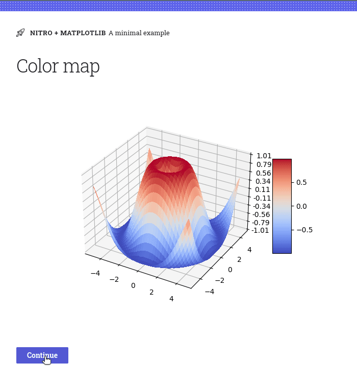

# Matplotlib plugin for H2O Nitro

This plugin lets you use [Matplotlib](https://matplotlib.org/stable/index.html) visualizations
in [Nitro](https://nitro.h2o.ai)
apps.

**Warning: Do not use pyplot!** pyplot maintains references to the opened figures to make show() work, but this will
cause memory leaks unless the figures are properly closed[1].

## Demo

[View source](example).



## Install

```
pip install h2o-nitro-matplotlib
```

## Usage

1. Import `matplotlib_plugin` and `matplotlib_box` from `h2o_nitro_matplotlib`.
2. Add `matplotlib_plugin()` to your Nitro app.
3. Use `matplotlib_box(model)` to render Matplotlib models (figures, widgets, and so on).

```py 
from matplotlib.figure import Figure
from h2o_nitro import View, web_directory
from h2o_nitro_matplotlib import matplotlib_plugin, matplotlib_box


def main(view: View):
    view(matplotlib_box(make_plot()))


nitro = View(
    main,
    title='Nitro + Matplotlib',
    caption='A minimal example',
    plugins=[matplotlib_plugin()],  # Include the Matplotlib plugin
)

def make_plot():
    x = np.linspace(0, 2, 100)  # Sample data.

    # Important: Generate the figure **without using pyplot**.
    fig = Figure()

    ax = fig.subplots()
    ax.plot(x, x, label='linear')  # Plot some data on the axes.
    ax.plot(x, x ** 2, label='quadratic')  # Plot more data on the axes...
    ax.plot(x, x ** 3, label='cubic')  # ... and some more.
    ax.set_xlabel('x label')  # Add an x-label to the axes.
    ax.set_ylabel('y label')  # Add a y-label to the axes.
    ax.legend()  # Add a legend.

    return fig

```

[^1]: See [Matplotlib docs on embedding](https://matplotlib.org/3.5.0/gallery/user_interfaces/web_application_server_sgskip.html)
.

