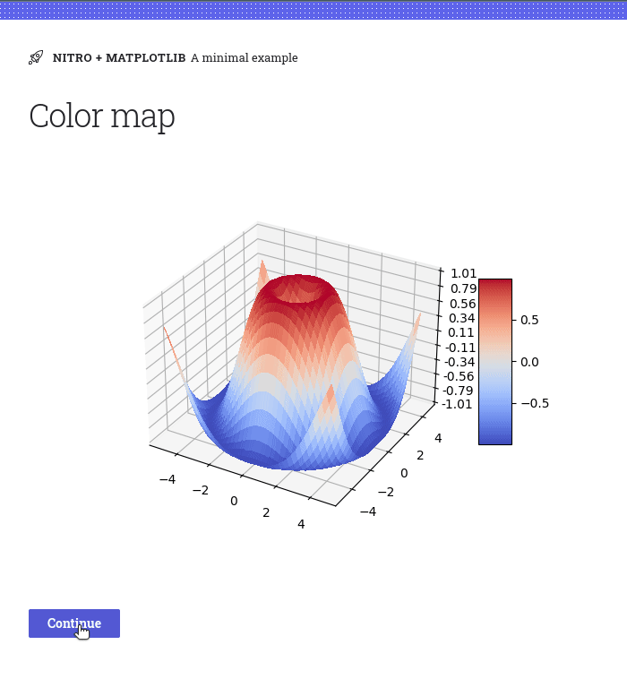
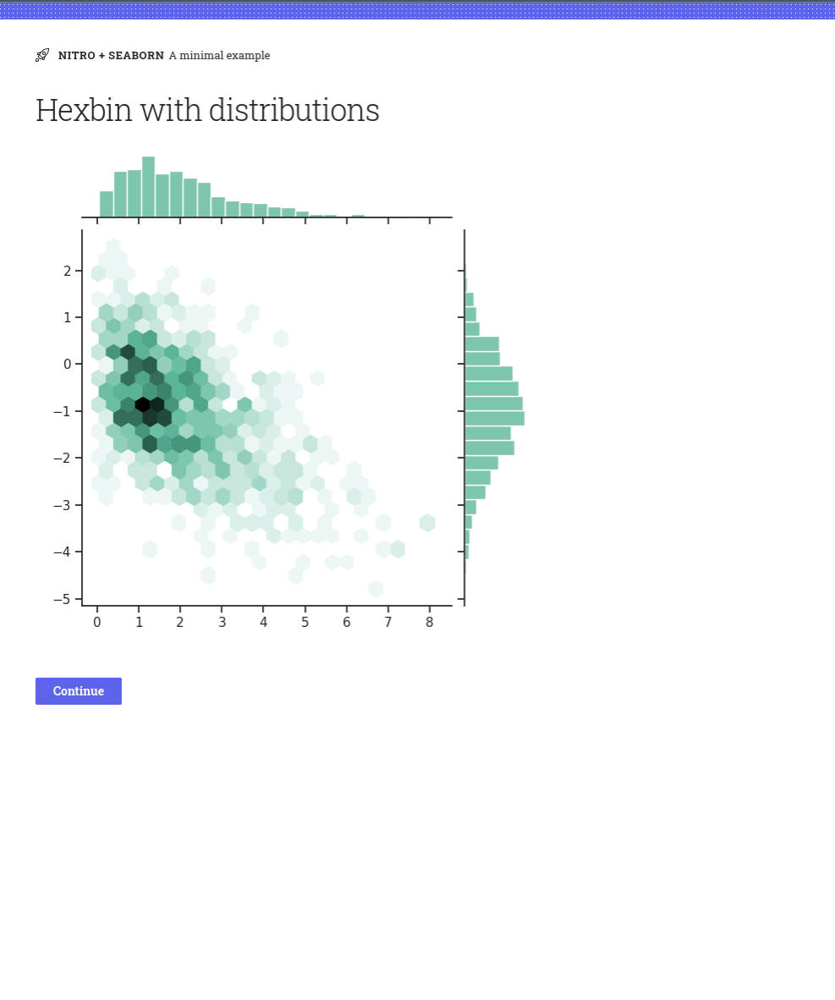

# H2O Nitro Matplotlib Sample App

## Try it out!

### Setup

```
$ wget https://raw.githubusercontent.com/h2oai/nitro-matplotlib/main/example/matplotlib_demo.py
$ wget https://raw.githubusercontent.com/h2oai/nitro-matplotlib/main/example/seaborn_demo.py
$ wget https://raw.githubusercontent.com/h2oai/nitro-matplotlib/main/example/requirements.txt
$ python3 -m venv venv
$ ./venv/bin/activate
(venv) $ pip install -r requirements.txt
(venv) $ python matplotlib_demo.py
```

### Run the matplotlib demo

```
(venv) $ python matplotlib_demo.py
```



### Run the seaborn demo

```
(venv) $ python seaborn_demo.py
```


